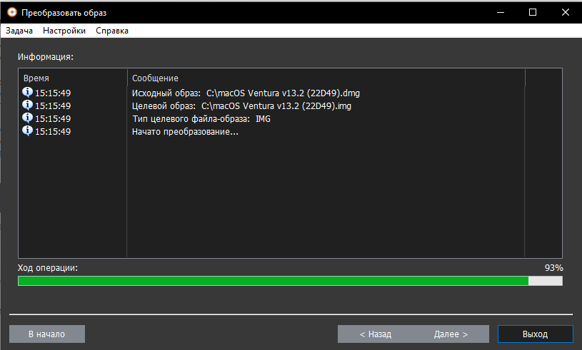
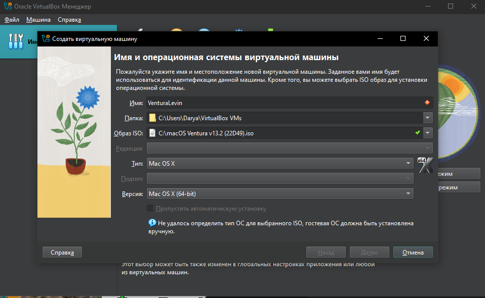
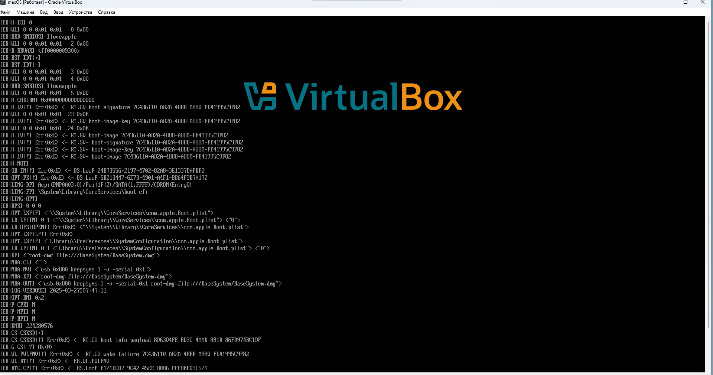
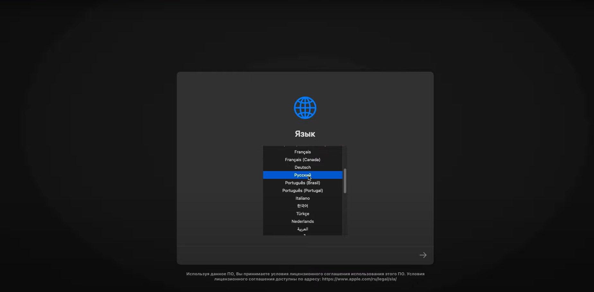
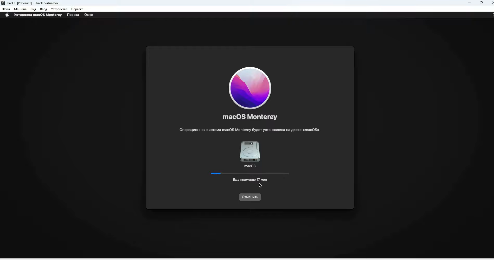
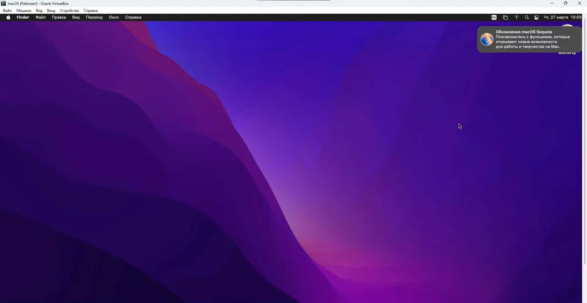

# Отчет по установке macOS Ventura и Linux

## Установка macOS Ventura

### 1. Подготовка к установке
- **Загрузка установщика**:  
  Использована программа Oracle VM Virtual box. Образ ISO загружен с официального сайта Mac App Store.
- **Создание загрузочного USB**:  
 Зачем - то скачал .dmg файл, преобразовываю в iso для VirtualBox
 
 Настройка машины:
 

### 2. Процесс установки
- **Вход в меню загрузки**:  
Установка ОС
  
- **Установка системы**:  
  
  

### 3. Настройка системы
- **Сетевые настройки**:  
  Подключение к Wi-Fi выполнено успешно.  

Система Установлена и обновлена

---

## Установка Linux (Ubuntu 22.04 LTS)

### 1. Подготовка
- **Выбор дистрибутива**: Выбрана Ubuntu 22.04 LTS.  
- **Скачивание и настройка ВМ для ОС**:  
  Использована программа Oracle VM Virtual box. Образ ISO загружен с официального сайта Ubuntu.
  

### 2. Процесс установки
Настроил ВМ, следовал инструкциям установки


### 3. Установка ПО
- **Обновление системы**:  

  ```
- **Установка пакетов**:  
  Ubuntu сам предложил установочные пакеты, обновил всякие шняги
  

---

